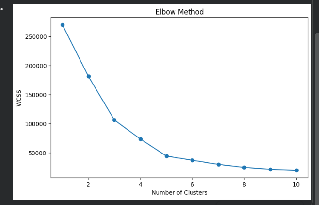
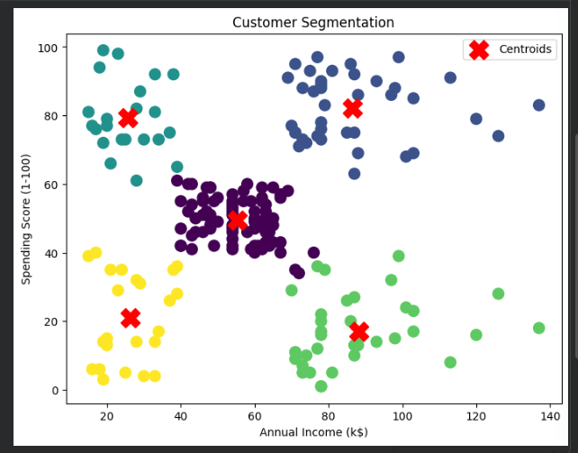
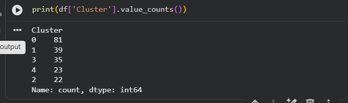

 # Customer Segmentation using K-Means Clustering

## 📌 Project Overview

This project focuses on customer segmentation using the K-Means Clustering algorithm. The goal is to group customers into different segments based on their Annual Income and Spending Score.

Customer segmentation helps businesses understand customer behavior and create targeted marketing strategies.

---

## 🎯 Objective

To segment mall customers into different groups based on their purchasing behavior and income levels using an unsupervised machine learning algorithm.

---

## 📂 Dataset

**Dataset:** Mall Customers Dataset

The dataset contains customer information including:

- Customer ID
- Gender
- Age
- Annual Income (k$)
- Spending Score (1-100)

---

## 🛠 Technologies Used

- Python
- Pandas
- NumPy
- Matplotlib
- Scikit-Learn
- Google Colab

---

## 📊 Features Used

The following features were used for clustering:

- Annual Income (k$)
- Spending Score (1-100)

---

## 🤖 Machine Learning Algorithm

### K-Means Clustering

K-Means is an unsupervised machine learning algorithm used to group similar data points into clusters.

---

## 📈 Methodology

### 1. Data Loading

Loaded the Mall Customers dataset using Pandas.

### 2. Feature Selection

Selected:

- Annual Income (k$)
- Spending Score (1-100)

### 3. Elbow Method

Used the Elbow Method to determine the optimal number of clusters.

### 4. K-Means Clustering

Applied K-Means Clustering with:

- Number of Clusters = 5

### 5. Visualization

Visualized customer segments and cluster centroids.

---

## 📈 Results

- Applied Elbow Method to determine optimal clusters.
- Identified **5 customer segments**.
- Successfully grouped customers based on Annual Income and Spending Score.
- Visualized customer clusters and centroids.
- Generated segmented customer data for analysis.

### Cluster Distribution

- Cluster 0 → 81 Customers
- Cluster 1 → 39 Customers
- Cluster 2 → 22 Customers
- Cluster 3 → 35 Customers
- Cluster 4 → 23 Customers

---

## 📷 Project Screenshots

### Elbow Method Graph

### Customer Segmentation Graph

### Cluster Output

---

## 🎓 Learning Outcomes

- Data Preprocessing
- Feature Selection
- Elbow Method
- K-Means Clustering
- Customer Segmentation
- Data Visualization
- Unsupervised Machine Learning

---

## 🚀 Outcome

Successfully performed customer segmentation using K-Means Clustering and gained hands-on experience in unsupervised machine learning.

This project was completed as part of my Machine Learning Internship at SkillCraft Technology.
